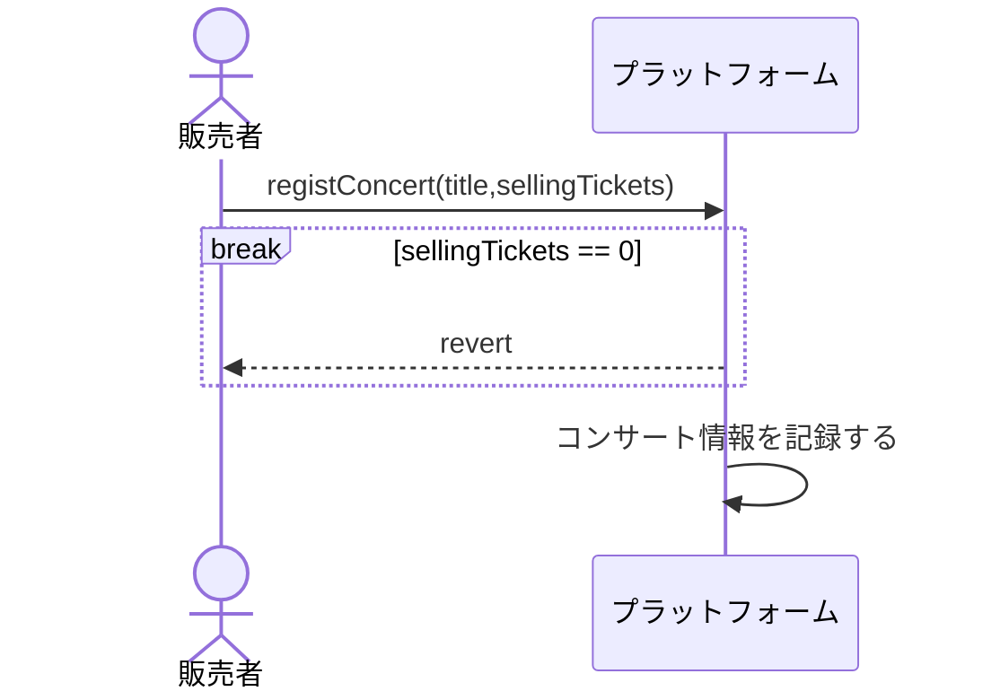
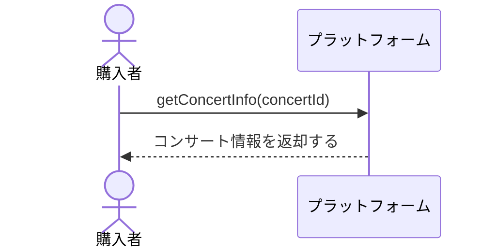
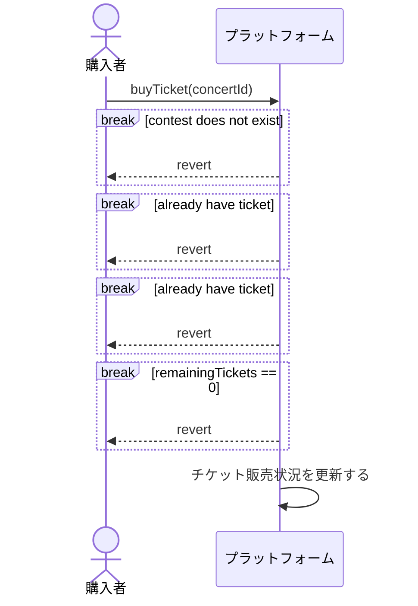
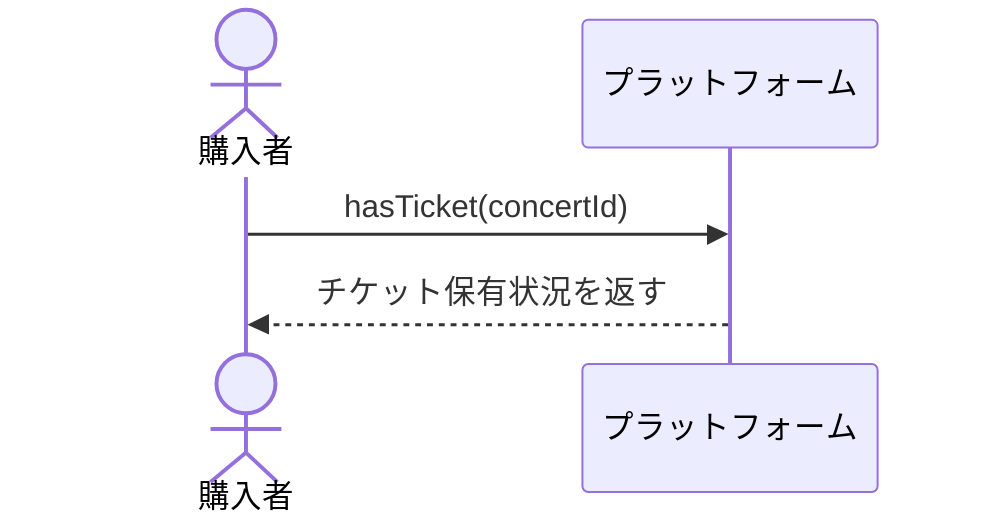

# シーケンス
## コンサートを登録する

```mermaid
sequenceDiagram
actor seller as 販売者
participant platform as プラットフォーム
seller->>platform: registConcert(title,sellingTickets)
break sellingTickets == 0
platform -->>seller: revert
end
platform->>platform: コンサート情報を記録する
```

## コンサート情報を確認する

```mermaid
sequenceDiagram
actor buyer as 購入者
participant platform as プラットフォーム
buyer->>platform: getConcertInfo(concertId)
platform-->>buyer: コンサート情報を返却する
```

## チケットを購入する

```mermaid
sequenceDiagram
actor buyer as 購入者
participant platform as プラットフォーム
buyer->>platform: buyTicket(concertId)
break contest does not exist
    platform -->>buyer: revert
end
break already have ticket
    platform -->>buyer: revert
end
break already have ticket
    platform -->>buyer: revert
end
break remainingTickets == 0
    platform -->>buyer: revert
end
platform->>platform: チケット販売状況を更新する
```

## チケット保有を確認する

```mermaid
sequenceDiagram
actor buyer as 購入者
participant platform as プラットフォーム
buyer->>platform: hasTicket(concertId)
platform-->>buyer: チケット保有状況を返す
```