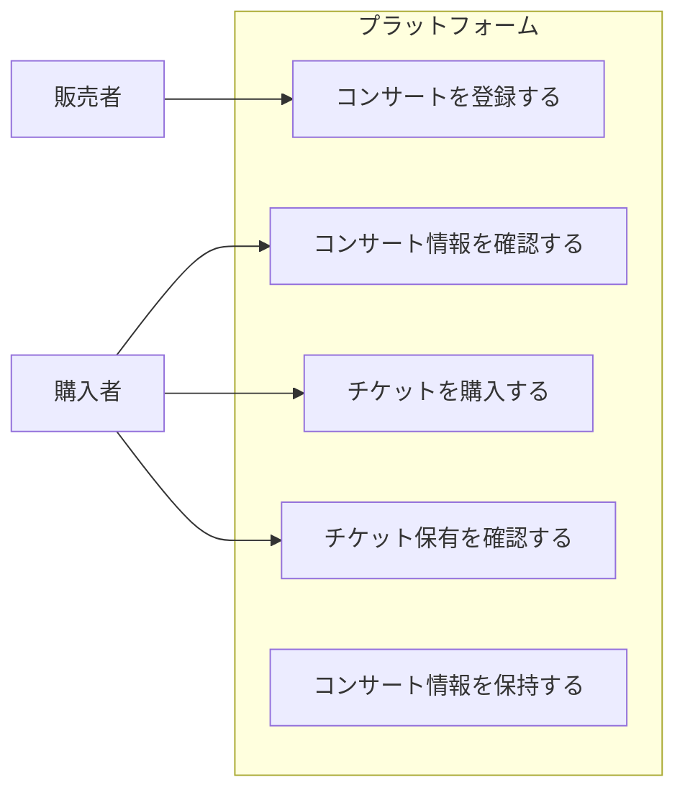

# ユースケース

```mermaid
graph LR
seller[販売者]
buyer[購入者]
subgraph platform [プラットフォーム]
    p1[コンサートを登録する]
    p2[コンサート情報を確認する]
    p3[チケットを購入する]
    p4[チケット保有を確認する]
    p5[コンサート情報を保持する]
end
seller-->p1
buyer-->p2
buyer-->p3
buyer-->p4
```